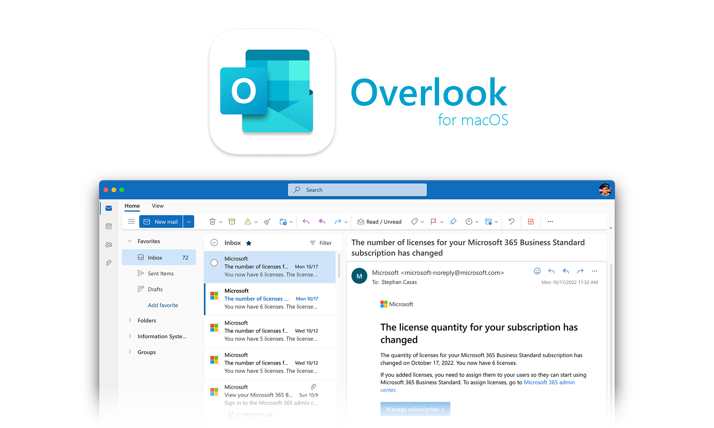
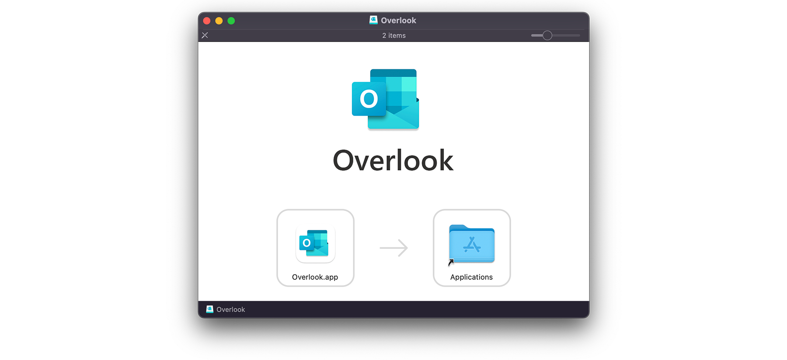

<p align="center"></p>

# Overlook

Overlook is Microsoft Outlook if you ordered Microsoft Outlook from [Wish.com](https://www.reddit.com/r/wishwtf/top/?t=all). It is the Outlook Web App (OWA) wrapped inside of an [Electron](https://www.electronjs.org/) app with responders for the `mailto` URL scheme and other niceties that contribute to a native-like experience.

## Why?

Because a very specific ERP/CRM vendor decided years ago that they weren't going to support anything except Mac Mail, and now Mac Mail can't work with Exchange Online shared mailboxes because Microsoft pulled the plug on IMAP basic auth. More on this later...

## Install

**[Download the latest release](https://github.com/stephancasas/overlook/releases/latest)**, and open the disk image. Drag Overlook into your **/Applications** directory to complete the installation.

<p align="center"></p>


## Use

Launch the application and sign-in like you would in the browser. That's it. It's just [outlook.office365.com](http://outlook.office365.com) running as a desktop app.

## Protocols

Overlook supports two mail-oriented protocols — allowing you to use it as the default handler for responding to e-mail-related events in macOS.

### `mailto`

On its first run after installation in the `/Applications` directory, Overlook will register itself as a capable handler for the `mailto:` protocol. If you wish to use it as the default handler for `mailto` links, open Mac Mail's preferences and set the default mail client to Overlook.

**[Example: Send E-mail to Stephan](mailto:stephancasas@icloud.com?subject=TPS%20Reports&body=Hi%2C%20Stephan%3A%0A%0ADid%20you%20get%20the%20memo%20about%20the%20cover%20pages%20for%20your%20TPS%20reports%3F%0A%0AThanks%2C%0ADom)**

```
mailto:stephancasas@icloud.com?subject=TPS%20Reports&body=Hey%2C%20Stephan%3A%0A%0ADid%20you%20get%20the%20memo%20about%20the%20cover%20pages%20for%20your%20TPS%20reports%3F%0A%0AThanks%2C%0ARon
```

### `x-mailto`

In addition to the RFC-compliant `mailto` protocol, Overlook registers a private protocol, `x-mailto`, which is an extended version of standard `mailto`-style URIs. This extended protocol provides support for attachment handling/upload, setting the sender (from) address, and providing the option to dispatch messages immediately after composition.

**Extended Fields**

| Field        | Description                                                                                                                                                               |
| :----------- | :------------------------------------------------------------------------------------------------------------------------------------------------------------------------ |
| `attachment` | The absolute path to a file you wish to include in the message as an attachment. This field is repeatable for multiple files.                                             |
| `from`       | The address from which the message should originate. This should only be in the format `<user>@<domain>` — do not include the identity alias.                             |
| `send`       | When given as `send=yes`, Overlook will automatically dispatch your composed message after all composition events have been received (i.e. all attachments are uploaded). |

**[Example: Auto-send E-mail With Attachments Using Sender...](x-mailto:stephancasas@icloud.com?subject=TPS%20Reports&body=Hi%2C%20Stephan%3A%0A%0AWe're%20putting%20cover%20sheets%20on%20all%20of%20our%20new%20TPS%20reports.%20I've%20included%20a%20copy%20of%20that%20memo%20for%20you%20to%20review.%0A%0AThanks%2C%0ADom&attachment=%2FUsers%2FDom%2FDownloads%2Femployee%20tps%20report%20memo.pdf&attachment=%2FUsers%2FDom%2FDownloads%2Ftps-reports.ppt&from=human_resources%40initech.com&send=yes)**

```
x-mailto:stephancasas@icloud.com?subject=TPS%20Reports&body=Hi%2C%20Stephan%3A%0A%0AWe're%20putting%20cover%20sheets%20on%20all%20of%20our%20new%20TPS%20reports.%20I've%20included%20a%20copy%20of%20that%20memo%20for%20you%20to%20review.%0A%0AThanks%2C%0ADom&attachment=%2FUsers%2FDom%2FDownloads%2Femployee%20tps%20report%20memo.pdf&attachment=%2FUsers%2FDom%2FDownloads%2Ftps-reports.ppt&from=human_resources%40initech.com&send=yes
```

## What's the purpose of this?

There are many macOS applications (both legacy and current) which invoke the user's e-mail client to send messages with attachments. Those which were designed to work with Mac Mail or earlier versions of Outlook usually accomplished this using [Apple Events](https://en.wikipedia.org/wiki/Apple_event).

When Microsoft dropped support for IMAP basic auth, they didn't provide users a channel through which they could open shared mailboxes from non-Outlook e-mail clients. This left ExchangeOnline subscribers with two choices:

- Purchase Microsoft 365 Business Standard for every user
- Instruct users to access their mail via the Outlook Web App

The first option is an added cost which, in this economy, may not be affordable to small businesses. However, cost aside, the current version of Outlook can best be described as half-baked and, to make matters more complicated, Microsoft didn't provide parity for scripting grammar between the current version of Outlook and the previous version — meaning third-party IPC is broken entirely.

As far as the second option goes, there are no IPC channels for automating the Outlook Web App, so that's effectively a dead end.

Installing OWA as a desktop application, with full control over the browser in which it is being run (Chromium), allows for the injection of custom code at runtime that can expose necessary functions for automation in macOS. By implementing such automation via URI scheme — a widely-usable form of IPC — existing applications are more likely to support integration without requiring major changes.

## Contributing / Notes

I wrote this in a hurry because I had an immediate need for it. The time crunch, combined with the need to reverse engineer OWA at the developer console, made for an *interesting* experience. If the codebase seems a bit disorderly, please don't be afraid to open a PR with major opportunities for restructuring. Additionally, this is my first Electron application, so if there's an easier way to do something, I'm very open to ideas for improvement.

### Continuity

How long will this application work? I don't know. If Microsoft changes the OWA source significantly, then not very long. In the event that they decide to send me a cease and desist order, then even shorter than that. Please don't do that.